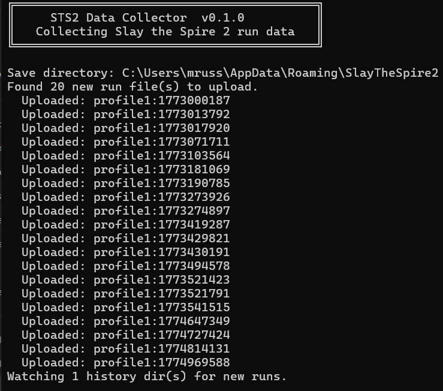

# STS2 Data Collector

[](https://github.com/JoeyRussoniello/STS2-Data-Collector/releases/latest)
[](https://github.com/JoeyRussoniello/STS2-Data-Collector/actions/workflows/ci.yml)
[](https://sts2-data-collector-production.up.railway.app/docs)
[](https://sts-2-data-collector.vercel.app/)
[](LICENSE)

There's no public dataset for Slay the Spire 2 run data yet. This project aims to change that.

STS2 Data Collector is a lightweight background tool that watches for completed runs on your machine and uploads them to a shared, open database. The goal is to build a community dataset large enough to power stats pages, dashboards, visualizations, and modeling projects. Think character win rates, card power rankings, ascension breakdowns, and anything else the community comes up with.

## Contributing runs

1. [Download the latest release](https://github.com/JoeyRussoniello/STS2-Data-Collector/releases)
2. Run the executable

That's it. The collector will:

- Find your STS2 save folder automatically
- Upload completed `.run` files to the shared database
- Deduplicate so the same run is never sent twice
- Hash your Steam ID before storage (it is never stored in plain text)
- **File monitoring stops as soon as the executable stops running, and will catch any new runs the next time it starts up**



## Dashboard: The Eldritch Archive

**[https://sts-2-data-collector.vercel.app](https://sts-2-data-collector.vercel.app/)**

The Eldritch Archive is a live analytics dashboard built on top of the collected run data. It features global stats, per-character breakdowns, card power rankings, relic win-rate leaderboards, and an encounter lethality index.

After uploading data, you can view your own personal stats by appending your Steam ID to any page URL:

```
https://sts-2-data-collector.vercel.app/#overview/<your-steam-id>
```

The client prints a direct link to your personal dashboard after startup.

## Public API

All collected run data is available through a free, read-only API. No authentication required.

[Full API documentation (Swagger)](https://sts2-data-collector-production.up.railway.app/docs#/public)

**Base URL:** `https://sts2-data-collector-production.up.railway.app`

### Runs

```
GET /api/runs?limit=50&offset=0    # List runs (paginated)
GET /api/runs/{run_id}             # Get a single run
```

| Parameter | Type | Default | Description |
|-----------|------|---------|-------------|
| `limit` | int | 50 | Results per page (1 to 200) |
| `offset` | int | 0 | Number of results to skip |

<details>
<summary>Example response</summary>

```json
{
  "runs": [
    {
      "run_id": "abc123:Profile1:run_001",
      "steam_id_hash": "abc123...",
      "profile": "Profile1",
      "file_name": "run_001",
      "file_size": 4096,
      "data": { "win": true, "ascension": 5, "acts": ["..."] },
      "uploaded_at": "2026-03-31T12:00:00Z"
    }
  ],
  "total": 1542,
  "limit": 50,
  "offset": 0
}
```

</details>

### Analytics

```
GET /api/stats/summary                              # High-level totals
GET /api/stats/character-win-rates                   # Win rates by character
GET /api/stats/top-cards?limit=20&min_appearances=10 # Card power rankings
GET /api/stats/daily-trends?days=14                  # Recent daily trends
```

### Example

```python
import requests

resp = requests.get(
    "https://sts2-data-collector-production.up.railway.app/api/runs",
    params={"limit": 100},
)
runs = resp.json()["runs"]
wins = [r for r in runs if r["data"]["win"]]
print(f"{len(wins)} wins out of {len(runs)} runs")
```

### Rate limits

Public endpoints are limited to **30 requests per minute** per IP address.

## Privacy

- Steam IDs are HMAC-SHA256 hashed with a secret salt before storage. Raw IDs are never persisted.
- Only `.run` file data is uploaded (game results, not personal info).
- Uploads are deduplicated, so re-running the client won't create duplicates.

## Feedback and contributing

Ideas for useful stats, bug reports, and PRs are all welcome. Open an issue or reach out!

*Not affiliated with Mega Crit. This is a community project.*

---

# Technical details

Everything below is for developers who want to build on, self-host, or contribute to the project itself.

## Architecture

The repo is a monorepo with two independent components:

```
client/   -- Rust (edition 2024): background service, filesystem watcher, HTTP uploader
backend/  -- Python 3.13 (FastAPI + SQLAlchemy + asyncpg): REST API, hexagonal architecture
```

### Client

The client is a single-binary Rust application that watches the STS2 save directory for new `.run` files and uploads them to the backend.

| Module | Purpose |
|--------|---------|
| `main.rs` | Orchestrator: load state, startup scan, watcher event loop |
| `discovery.rs` | Filesystem walking to find save directories and `.run` files |
| `record.rs` | `RunFileRecord` type and path parsing |
| `state.rs` | Local dedup via `uploaded_runs.txt` (HashSet backed by flat file) |
| `upload.rs` | HTTP POST to the backend API |
| `watcher.rs` | `notify` crate integration for filesystem events |
| `tests/mod.rs` | Tests using `tempfile` for isolated temp directories |

**Save directory structure:** `<base>/steam/<steam_id>/<profile>/saves/history/*.run`

**Environment variables:**

| Variable | Default | Description |
|----------|---------|-------------|
| `STS2_BASE_DIR` | Auto-detected | Override the STS2 save directory |
| `STS2_SERVER_URL` | `http://localhost:8000` | Backend URL for uploads |

### Backend

The backend follows hexagonal (ports and adapters) architecture. Business logic lives in `domain/` with no framework imports.

```
app/
  config.py              -- Pydantic settings, reads .env
  domain/
    models.py            -- RunRecord dataclass, HMAC-SHA256 hashing
    ports.py             -- Repository ABCs
    services.py          -- Business logic only
  adapters/
    postgres/
      database.py        -- Async SQLAlchemy engine + session factory
      models.py          -- ORM model (JSONB data column)
      repository.py      -- PostgresRunRepository
  api/
    schemas.py           -- Pydantic request/response DTOs
    dependencies.py      -- DI wiring (session -> repo -> service)
    routes/
      runs.py            -- POST /runs, GET /runs/{run_id}
      stats.py           -- GET /api/stats/* (public analytics)
      health.py          -- GET /health
```

**Key design decisions:**

- The server generates global run IDs (`{steam_id_hash}:{profile}:{file_name}`). The client never sees or sends a global ID.
- The client's local dedup key is `profile:file_name` (no Steam ID). This is only used in `uploaded_runs.txt`.
- POST /runs accepts the raw Steam ID in the request body. It is hashed server-side before storage.
- Upsert uses a unique constraint on `(steam_id_hash, profile, file_name)`, so re-uploads update rather than duplicate.
- Run data is stored as JSONB, unprocessed.
- Upload endpoints require an API key (`X-API-Key` header). Public read endpoints do not.

## Build and test

```sh
# Client
cd client
cargo build --release
cargo test

# Backend
cd backend
uv sync
uv run alembic upgrade head   # apply migrations
uv run python main.py         # start server on :8000
```

## Database

- PostgreSQL (cloud: Neon free tier, local: standard install)
- Async via `asyncpg` driver (connection strings use `postgresql+asyncpg://`)
- Migrations managed by Alembic (async `env.py`)
- Config in `backend/.env` (gitignored)

## License

[MIT](LICENSE)
